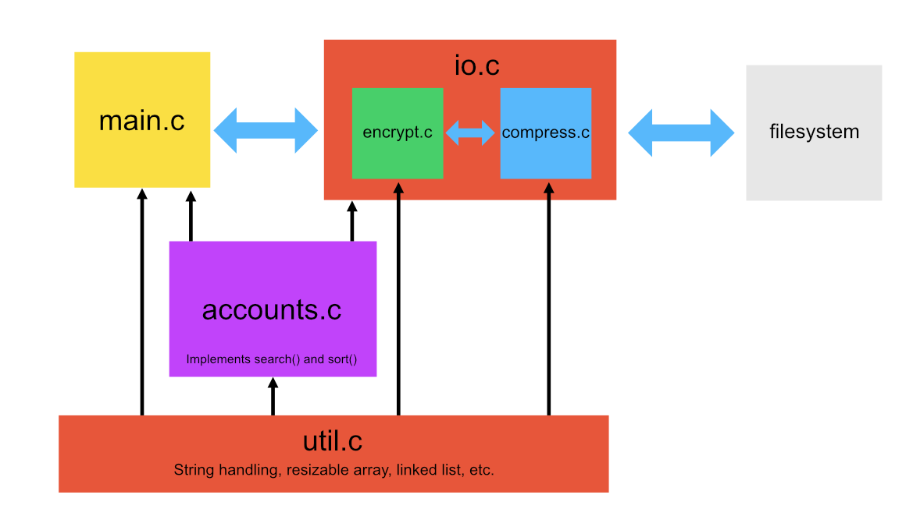

# PasswordManager


## Design Overview



## Students: 
* Luke Phillips - 13591476
* Sam Zammit - 99201838
* Peter de Vroom - 13294196
* Giovanni Tjandra - 13752454
* Joshua Gonzalez - 13915158

## Quick-Start Operation Guide:
1. Download and save the repository to a folder.
2. Use your compiler's make command to build the project. 
    * mingw32-make win (for MinGW on windows)
    * make (for ED)
    * make build (for Linux)
3. Run the build project with './Pass.out'
4. Follow the on-screen prompts to use the program.

## Illegal Characters for Passwords:
```
| \ ; : ' " , . / ~ 
```
